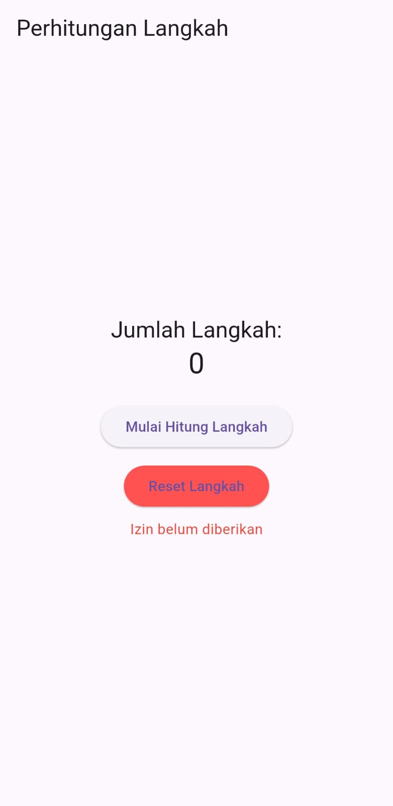
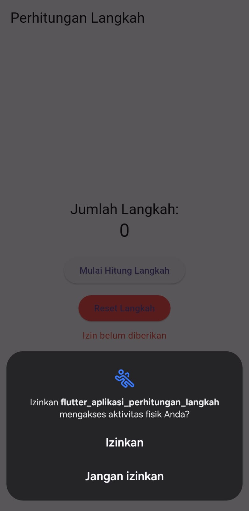
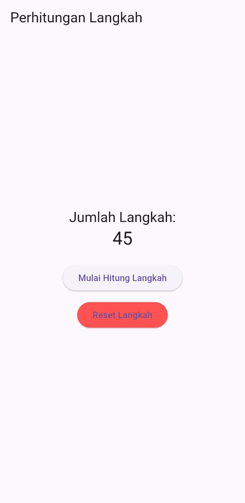

# 🏃‍♂️ flutter_aplikasi_perhitungan_langkah

## 👤 Nama  
**Raja Walidain**  
_NIM: 4522210013_

---

## 🎯 Tujuan Praktikum

Praktikum ini bertujuan untuk:

- Mempelajari penggunaan sensor **pedometer** pada perangkat Android melalui Flutter
- Mengelola perizinan aktivitas fisik menggunakan `permission_handler`
- Mengimplementasikan penyimpanan data offset langkah dengan `SharedPreferences`
- Mengembangkan aplikasi real-time yang dapat membaca langkah pengguna

---

## 📱 Deskripsi Aplikasi

**flutter_aplikasi_perhitungan_langkah** adalah aplikasi sederhana berbasis Flutter yang digunakan untuk menghitung jumlah langkah pengguna. Dengan menekan tombol **Mulai Hitung Langkah**, aplikasi akan membaca jumlah langkah menggunakan sensor internal Android. Pengguna juga dapat melakukan **reset langkah** agar perhitungan dimulai dari awal.

---

## 🖼️ Screenshot Emulator

| Tampilan Awal | Izin Akses | Hitung Langkah |
|---------------|------------|----------------|
|  |  |  |

---

## 🧠 Penjelasan Program

Aplikasi ini dibangun menggunakan:

- **Bahasa:** Dart
- **Framework:** Flutter
- **Plugin yang digunakan:**
  - [`pedometer`](https://pub.dev/packages/pedometer): untuk membaca langkah dari sensor
  - [`permission_handler`](https://pub.dev/packages/permission_handler): untuk meminta izin akses `activity_recognition`
  - [`shared_preferences`](https://pub.dev/packages/shared_preferences): untuk menyimpan dan mengambil offset data langkah secara lokal

### 🌀 Flow Aplikasi

1. Pengguna menekan tombol **Mulai Hitung Langkah**
2. Aplikasi meminta izin akses aktivitas fisik (`activity_recognition`)
3. Jika diizinkan, sensor mulai membaca jumlah langkah saat ini
4. Offset awal disimpan untuk memastikan angka langkah dimulai dari 0
5. Langkah ditampilkan sebagai:  
   `Langkah Saat Ini - Offset`
6. Tombol **Reset Langkah** akan:
   - Menghapus nilai offset
   - Menghentikan stream langkah
   - Menampilkan angka 0

---

## 💡 Komponen UI

- `Scaffold` dan `Column` untuk struktur dasar
- `Text` untuk menampilkan jumlah langkah
- `ElevatedButton` untuk tombol interaktif
- `AlertDialog` (melalui widget `PermissionDialog`) untuk menangani konfirmasi izin sensor

---

## 📋 Pengujian Aplikasi

Aplikasi diuji pada perangkat **Samsung A55**.  
- Sensor langkah terdeteksi oleh aplikasi **Samsung Health**
- Namun, saat diuji menggunakan plugin `pedometer`, data langkah tidak muncul
- Kemungkinan karena perangkat tidak membuka sensor langkah untuk aplikasi pihak ketiga
- Meskipun begitu, alur aplikasi berjalan normal dan offset berhasil tersimpan serta di-reset dengan benar

---

## ▶️ Cara Menjalankan Aplikasi

```bash
flutter pub get
flutter run
