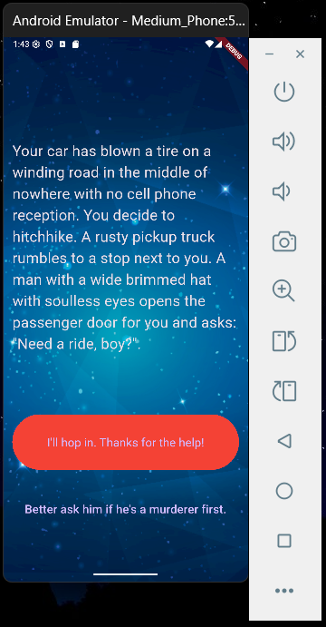

# 🌟 Destini App - Flutter Interactive Story App

## 📌 Nama  
**Raja Walidain**  
_NIM: 4522210013_

---

## 🎯 Tujuan Praktikum

Proyek ini dibuat untuk:

- Mempelajari konsep `StatefulWidget` dalam Flutter
- Mengimplementasikan logika bercabang dalam aplikasi interaktif
- Melatih keterampilan pemisahan kode menggunakan prinsip modular (OOP)
- Membangun aplikasi cerita interaktif berbasis pilihan ganda

---

## 📱 Deskripsi Aplikasi

**Destini App** adalah aplikasi cerita interaktif tempat pengguna menentukan alur cerita melalui pilihan yang tersedia. Cerita akan berkembang dan bercabang berdasarkan jawaban yang dipilih, hingga mencapai akhir yang berbeda-beda. Setelah cerita berakhir, pengguna dapat mengulang dari awal.

---

## 🛠️ Fitur Utama

- 🎭 Cerita bercabang berdasarkan pilihan pengguna
- 🧠 Logika alur cerita dikelola menggunakan class terpisah
- 🖼️ Tampilan menarik dengan latar belakang bergambar
- 👆 Navigasi menggunakan tombol pilihan (`TextButton`)
- 👁️‍🗨️ Tombol kedua otomatis disembunyikan jika tidak diperlukan
- 🔁 Tombol "Restart" untuk mengulang cerita dari awal

---

## 🗂️ Struktur Kode

lib/
├── main.dart # Tampilan utama & alur UI
├── story.dart # Model data cerita (Story)
└── story_brain.dart # Logika alur cerita & pilihan
assets/
└── images/
├── background.png
└── destini_page.png


---

## 🧠 Alur Logika Cerita

- Cerita dimulai dari indeks ke-0 (`_storyNumber = 0`)
- Fungsi `nextStory(int choice)` mengubah cerita berdasarkan pilihan
- Jika mencapai akhir (index 3, 4, atau 5), tombol "Restart" akan tampil
- Fungsi `buttonShouldBeVisible()` digunakan untuk mengontrol visibilitas tombol kedua

---

## 📸 Tampilan Aplikasi

| Tampilan Awal | Pilihan Cerita |
|---------------|----------------|
|  |  |

---

## ▶️ Cara Menjalankan Aplikasi

```bash
# Install dependencies
flutter pub get

# Jalankan di emulator atau device
flutter run
