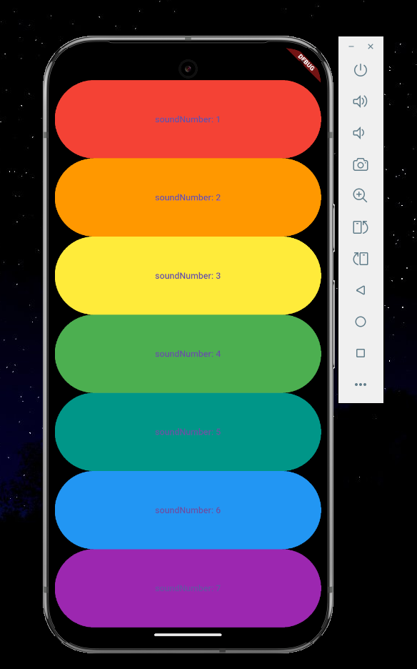

# 🎼 flutter_xylophone

## 👤 Nama  
**Raja Walidain**  
_NIM: 4522210013_

---

## 🎯 Tujuan Praktikum

Praktikum ini bertujuan untuk:

- Mempelajari penggunaan **audio player sederhana** dalam aplikasi Flutter
- Mengimplementasikan pemutaran **file audio lokal** dengan package `audioplayers`
- Membangun UI dinamis dan responsif menggunakan struktur widget

---

## 📱 Deskripsi Aplikasi

**flutter_xylophone** adalah simulasi alat musik Xylophone yang dibangun menggunakan Flutter.  
Aplikasi ini memungkinkan pengguna untuk menekan tombol-tombol berwarna yang masing-masing akan memainkan suara not musik (do, re, mi, dst).  
Tiap tombol memiliki warna dan suara khas, menciptakan pengalaman musikal yang interaktif dan menyenangkan.

---

## 🖼️ Screenshot Emulator



---

## 🧠 Penjelasan Program

- **Bahasa:** Dart  
- **Framework:** Flutter  
- **Plugin yang digunakan:** [`audioplayers`](https://pub.dev/packages/audioplayers) untuk memutar file audio lokal `.wav` dari folder `assets`

### 🔑 Fungsi Utama

- `playSound(int soundNumber)`  
  Fungsi untuk memutar file audio `note{soundNumber}.wav` ketika tombol ditekan.

- `buildKey()`  
  Membuat tombol warna-warni (menggunakan `Expanded` + `TextButton`) dan menghubungkannya ke fungsi `playSound`.

### 🧱 Struktur UI

- `MaterialApp` dan `Scaffold` sebagai kerangka dasar aplikasi
- `SafeArea` untuk menjaga agar UI berada di area aman tampilan
- `Column` + `Expanded` menyusun tombol dalam tata letak vertikal yang proporsional
- `TextButton` sebagai tombol interaktif yang dapat diklik

---

## 🎨 Struktur Warna dan Suara

| Tombol | Warna     | File Suara      |
|--------|-----------|-----------------|
| 1      | Merah     | note1.wav       |
| 2      | Oranye    | note2.wav       |
| 3      | Kuning    | note3.wav       |
| 4      | Hijau     | note4.wav       |
| 5      | Teal      | note5.wav       |
| 6      | Biru      | note6.wav       |
| 7      | Ungu      | note7.wav       |

---

## ▶️ Cara Menjalankan Aplikasi

```bash
flutter pub get
flutter run
