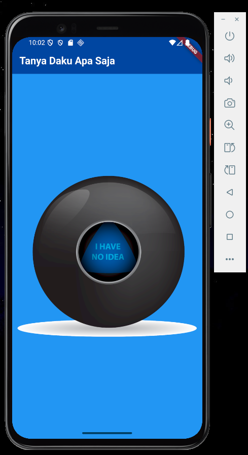
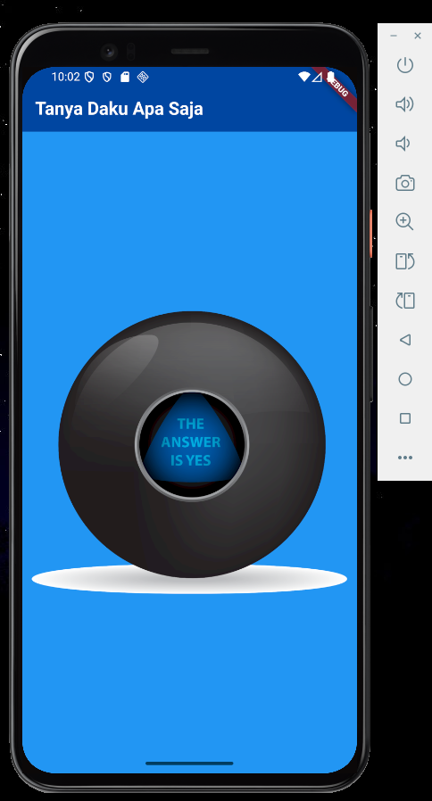

# 🎱 flutter_tanya_daku

## 👤 Nama  
**Raja Walidain**  
_NIM: 4522210013_

---

## 🎯 Tujuan Praktikum

Praktikum ini bertujuan untuk:

- Mempelajari penggunaan **logika acak** (`Random`) dalam Flutter
- Mengimplementasikan pengelolaan state dengan `StatefulWidget`
- Memahami cara memanipulasi UI berdasarkan aksi pengguna

---

## 📱 Deskripsi Aplikasi

**flutter_tanya_daku** adalah aplikasi permainan sederhana berbasis Flutter yang mensimulasikan **“Magic Ball”** (bola ajaib).  
Setiap kali gambar bola ditekan, aplikasi akan menampilkan jawaban secara acak dari 5 kemungkinan yang tersedia, memberikan kesan seperti sedang "bertanya pada bola ajaib".

---

## 🖼️ Screenshot Emulator

| Tampilan 1 | Tampilan 2 | Tampilan 3 |
|------------|------------|------------|
|  |  |  |

---

## 🧠 Penjelasan Program

- **Bahasa:** Dart  
- **Framework:** Flutter

### 🔧 Struktur dan Logika

- Terdapat satu halaman utama (`HalamanBola`) yang menampilkan judul aplikasi dan widget `Bola`
- Widget `Bola` menggunakan `StatefulWidget` untuk mengatur perubahan gambar secara acak
- Fungsi `Random().nextInt(5) + 1` digunakan untuk memilih angka 1–5 secara acak
- Gambar bola diubah berdasarkan angka tersebut, sehingga ditampilkan `assets/images/ball{n}.png`
- Fungsi `setState()` akan memicu rebuild tampilan setiap kali bola ditekan

### 🧱 Komponen UI

- `MaterialApp` & `Scaffold` sebagai kerangka aplikasi
- `AppBar` sebagai header dengan judul
- `Center` untuk memposisikan konten di tengah
- `TextButton` berisi gambar (`Image.asset`) sebagai elemen interaktif

---

## ▶️ Cara Menjalankan Aplikasi

```bash
flutter pub get
flutter run
